<picture>
  <source media="(prefers-color-scheme: dark)" srcset="https://capsule-render.vercel.app/api?type=waving&color=0:1a0b2e,50:8A2BE2,100:1a0b2e&height=220&section=header&text=Harsh%20Soni&fontSize=60&fontColor=faebee&animation=fadeIn&fontAlignY=38&desc=Software%20Engineer%20%40%20Nagarro%20%C2%B7%20AI%20Systems%20%26%20Agentic%20Frameworks&descAlignY=58&descSize=18" />
  
</picture>

  

 

## 👨‍💻 About Me

- 🎓 B.Tech CSE Graduate, The NorthCap University, 2025 &nbsp;|&nbsp; CGPA: 8.53
- 💼 **Software Engineer @ Nagarro** &nbsp;·&nbsp; Prev. Full Stack Intern @ TailorTalk
- 🤖 Building **Phoenix OS** — an agentic, spec-driven SDLC framework where **24 specialized agents** read/write against a **126-file memory layer** to turn AI coding assistants into deterministic delivery systems, tool-agnostic across Claude Code, Copilot, Codex & Cursor
- 🏦 Shipped performance improvements on enterprise banking-sector microservices (Spring Boot, multi-threaded modules)
- 🔭 Currently deep in **Spring Boot microservices**, **Next.js**, and **multi-agent AI orchestration**
- 🧠 Alumnus of **Amazon ML Summer School '23** (Top 5%, 60K+ applicants)
- ⚔️ **Codeforces Specialist** (1600+ rating) &nbsp;|&nbsp; **500+ DSA problems** solved
- 👯 Open to collaborate on **agentic AI** or impactful **open source** work
- 📫 **harsh9995soni@gmail.com**

 

## 🚀 Featured Projects

<table>
<tr>
<td width="50%" valign="top">

### 🔗 [TaskForge](https://github.com/harshcode1/TaskForge)
Jira-style project tracker — 18 REST endpoints, JWT auth with **service-layer RBAC**, drag-and-drop Kanban, **57 frontend + 12 backend tests**, multi-stage Docker builds.

`Spring Boot 3.5.3` `Spring Security 6` `Next.js 14` `MySQL` `Docker`

</td>
<td width="50%" valign="top">

### 🧠 [BetterMind](https://github.com/harshcode1/BetterMind)
AI mental-health platform — TOTP **2FA**, AES encryption at rest, rate-limiter factory, 3-role RBAC, clinically-validated PHQ-9/GAD-7 assessments, AI companion.

`Next.js 14` `MongoDB` `OpenAI` `JWT + 2FA`

</td>
</tr>
<tr>
<td width="50%" valign="top">

### 🔌 [QueryConnect](https://github.com/harshcode1/QueryConnect)
Community Q&A platform with a clean layered Spring Boot architecture and an **Angular 19** frontend, containerized end-to-end with Docker Compose.

`Spring Boot 3.4.5` `Angular 19` `MySQL` `Docker`

</td>
<td width="50%" valign="top">

### 🎬 [ai-video-pipeline](https://github.com/harshcode1/ai-video-pipeline)
Resumable AI video pipeline — TTS + AI image generation + ffmpeg render, with a **pluggable provider abstraction** that survived two live API-provider outages.

`Python` `TTS` `Image-Gen APIs` `ffmpeg`

</td>
</tr>
<tr>
<td colspan="2" valign="top">

### 📈 [Cryptonite](https://github.com/harshcode1/Cryptonite) — [Live Demo ↗](https://cryptonite-seven-phi.vercel.app/)
PWA crypto trading simulator — 6 cached API routes behind a **4-layer fallback chain**, installable offline PWA, real-time P&L on a virtual wallet.

`Next.js 14` `React 18` `CoinGecko API` `Recharts`

</td>
</tr>
</table>

 

## 🛠️ Tech Stack

 

## 📊 GitHub Analytics

  
  

  

 

## 🐍 Contribution Snake

  <picture>
    <source media="(prefers-color-scheme: dark)" srcset="https://raw.githubusercontent.com/harshcode1/harshcode1/output/github-contribution-grid-snake-dark.svg" />
    <source media="(prefers-color-scheme: light)" srcset="https://raw.githubusercontent.com/harshcode1/harshcode1/output/github-contribution-grid-snake.svg" />
    
  </picture>

 

## 🏆 Achievements
- 🥇 **Amazon ML Summer School '23** — Selected from 60,000+ applicants (~5% acceptance rate)
- ⚔️ **Codeforces Specialist** (1600+ rating, top 15% globally)
- 👨‍💻 **500+ DSA problems** solved across LeetCode, Codeforces & HackerRank
- ☁️ **AWS Certified** — Cloud Developing & Cloud Foundations

 

<picture>
  
</picture>
